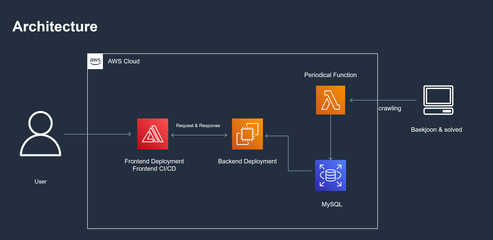
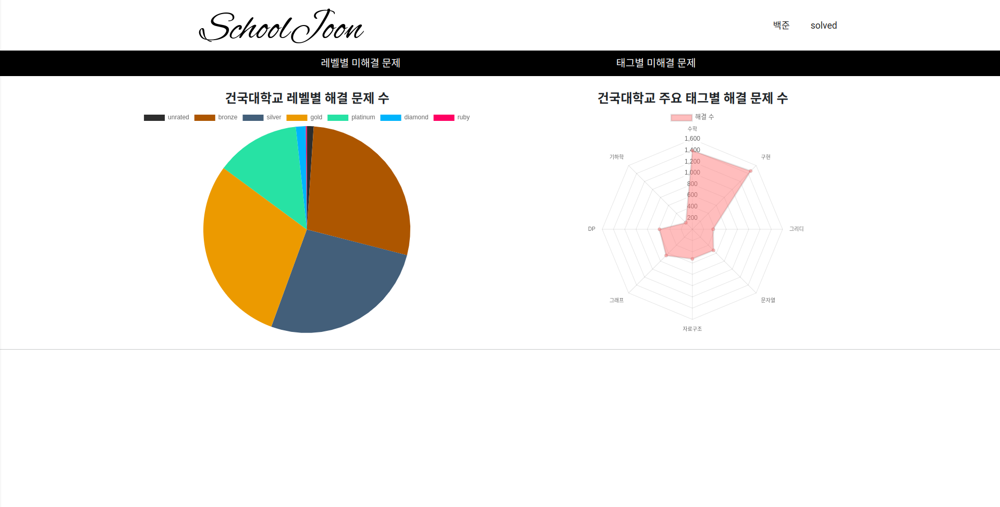
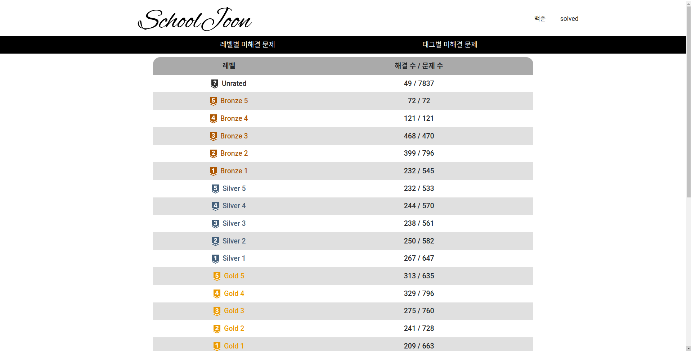
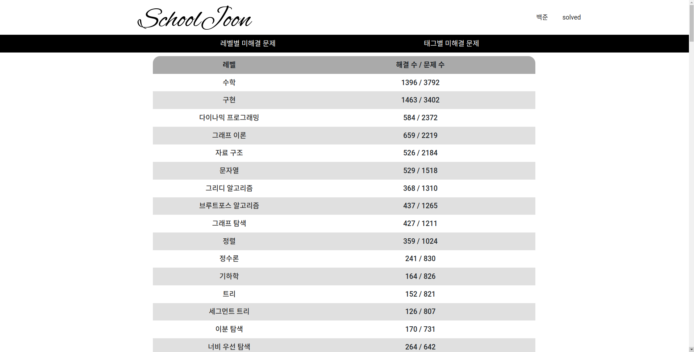
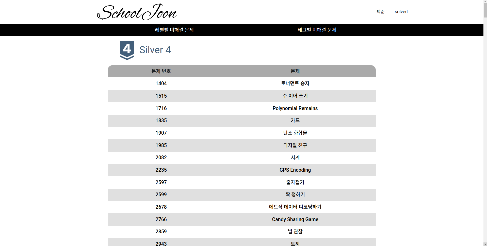

## SchoolJoon

 

특정 학교의 구성원들이 해결한 백준 문제들을 분석하는 프로젝트입니다.

(프로젝트명은 임시입니다.)

## [TODO list](https://github.com/riroan/SchoolJoon/blob/main/TODO.md)

## 아키텍처 구성

## 기여자
- [donghoony](https://github.com/donghoony)

## Demo

### 메인페이지

### 레벨별 미해결 문제

### 태그별 미해결 문제

### 특정 레벨 미해결 문제 리스트

## 기술스택

### FrontEnd

- React(typescript) + scss

- storybook

### BackEnd

- FastAPI(python)

- BeautifulSoup

### Database

- MySQL + PyMySQL
